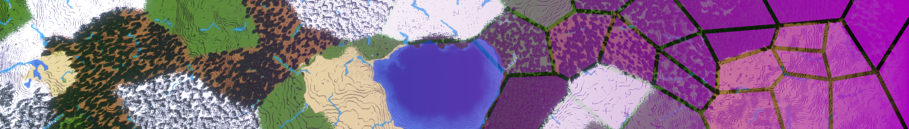
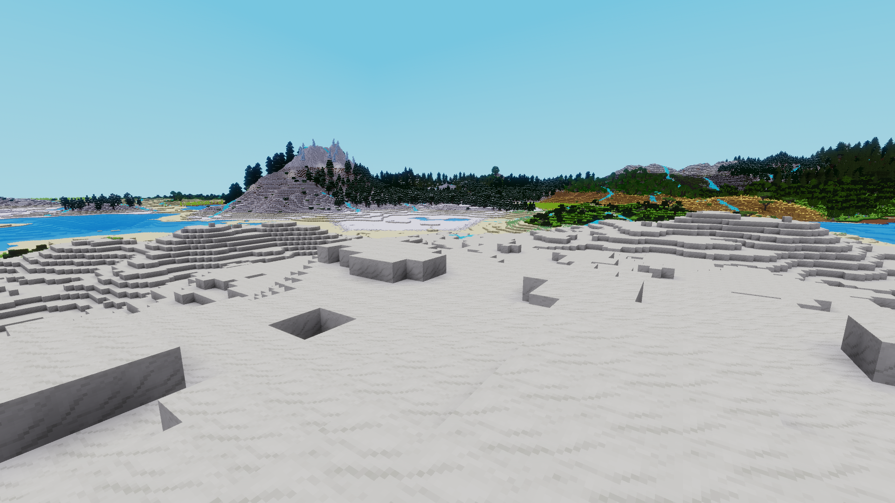
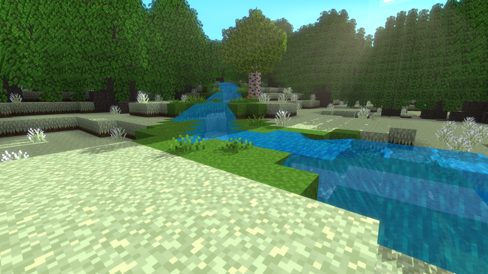
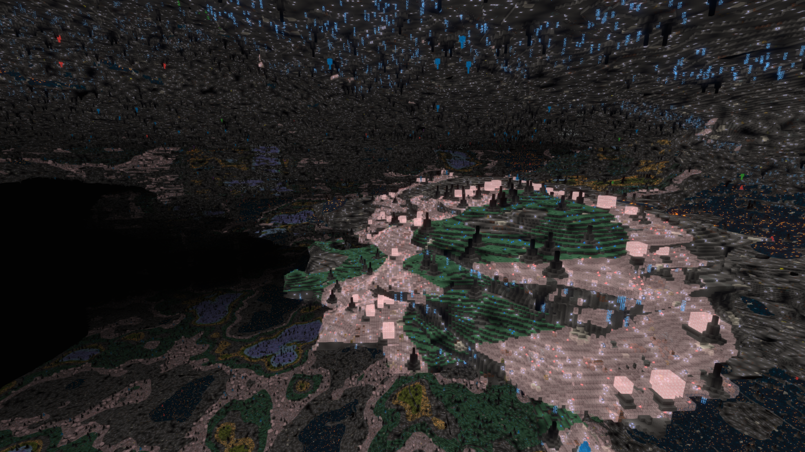

# Climate Zones Mapgen

For when *rare* should not mean *tiny*.

## Features

### Configurability

The Climate Zones Mapgen has a frankly absurd number of knobs to tweak. All of them already set to sensible presets. They are all documented [here](#Configuration).

### World Previews

One of those configurable knobs is the "World Scale". The world layout is preserved across scales, so you can preview a world quickly at a small scale, then just regenerate it with the same seed at the regular, playable scale.

### Climate Zones

Have predictably sized areas with the same climate. Making it much more likely to have your favorite biomes be large enough to live in or to extract plenty of resources from.

### Tectonic Zones

Want to build on a flat stretch of land? Easy.\
Want to build on a mountain peak? Also easy.

Tectonic zones restrict the height of mountains. So you can have flat plains with towering mountains as a backdrop. Or was it vice reversa?

### Small Details

The world is full of little touches that make it feel less repetitive despite all the distinct zones.

- Climbing into the mountains gets noticeably colder.
- Tiny streams bring some greenery to otherwise barren zones.

### Expansive Caverns

Caverns start relatively small closer to the surface. The deeper you go, the larger they can get. The caverns are connected by a web of weaving tunnels. These tunnels may on occasion breach the surface, leading you further down.

---

## Why Climate Zones?

Why should you care about climate zones?

Luanti biomes are defined by their heat and humidity values aka. their desired climate. Other (perlin or similar) noise based Mapgens generate "smooth" heat-maps and humidity-maps, which dictate how hot or humid a location is supposed to be. Luanti can then place the biome with the best fitting desired climate in said location.

Since the underlying climate-maps always transition smoothly from high to low values, this means that biomes also change gradually, with no sudden jumps. But it also has a few hefty drawbacks:

- There is no good way to control biome rarity.\
If a mod developer wants to add a *rare* biome, they have to "sandwich" it between other biomes in such a way that it is rarely the best option for the climate in any given area. But if that biome is rarely the correct choice and that choice is made on a per node basis, this biome will also be a lot smaller than the more common biomes. Even worse, just by adding more biomes through other mods, the player will also make every biome smaller by unknowingly sandwiching previously well-balanced biomes between the newly added ones.\
\
Left: An example of a rare biome that is sandwiched between its neighbors.\
Right: The biome with the darker sand is rarer but also smaller.

- Transitions are always the same.\
Since the biomes are defined in a static manner, they will *always* have the same neighbors.\
\
In this image, the green, yellow, and red biomes are defined very similarly. Yet the green biome can never have the red one as a neighbor, despite the red biome being closer in definition than either of the blue ones.

#### How Climate Zones Fix This

This Mapgen splits the terrain in many zones of roughly the same size. It then gives each of those zones its own climate. This way there is only one eligible biome for each of these zones. So if a specific biome is rare, it will be less likely to get picked for any specific zone. But if it does get picked, it will still take up the entirety of that zone.

> Biomes can also be restricted to specific altitudes. In those cases they could also change inside a climate zone.

Since these zones also do away with the smooth transitions, a biome will not always have the same neighbors. Any biome can now transition into any other biome, provided their definitions are similar enough.

---

## Configuration

## Disclaimer

This mod and its documentation were written by myself. I did however use ChatGPT to point out inconsistently used terms in both my description and documentation and to .