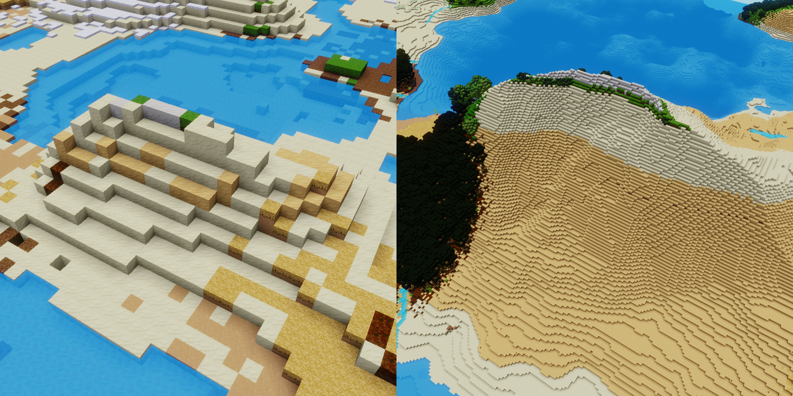
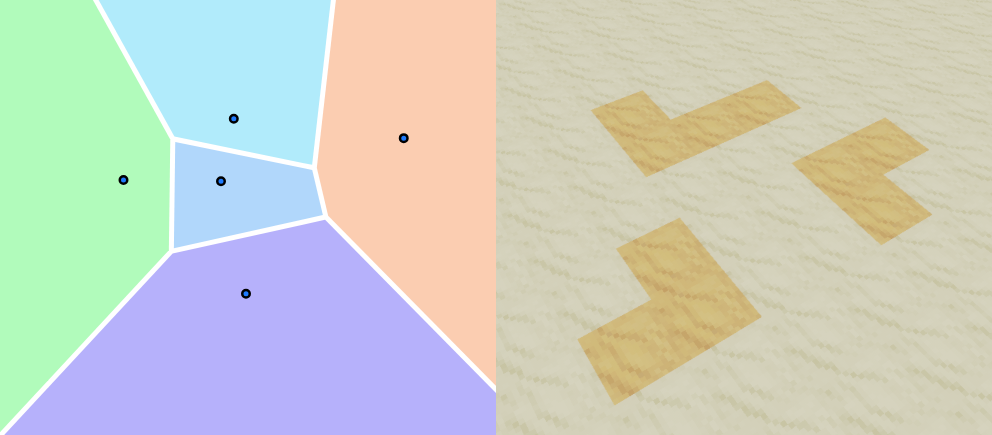
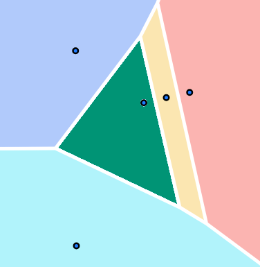
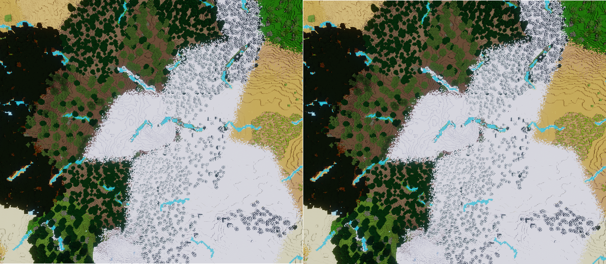

# Climate Zones Mapgen

For when *rare* should not mean *tiny*.

--- TODO add banner image

## Features

### Configurability

The Climate Zones Mapgen has a frankly absurd number of knobs to tweak. All of them already set to sensible presets. They are all documented [here](#Configuration).

### World Previews

One of those configurable knobs is the "World Scale". This can be used to generate a tiny version of a world to get a feel for what it will be like. Then just regenerate a world with the same seed at the regular scale.

### Climate Zones

Have predictably sized areas with the same biomes.

### Tectonic Zones

The world is split into many "tectonic zones" that are either more flat or mountainous. Prefer to build on a flat stretch of land? Doable. Want to build on a mountain peak? Also doable.

### Small Details

To prevent all these zones from feeling too samey, there are attitional features to add some variation:

- Temperature decreases with elevation.\
This makes the world feel more immersive and helps hide the grid pattern.

- Small rivulets add humidity.\
So even in the driest desert, there may be some plant life growing besides these little streams.

### Expansive Caverns

Caverns grow in size as you go deeper.

---

## Why Climate Zones?

Why should you care about climate zones?

Luanti biomes are defined by their heat and humidity values. Other (perlin or similar) noise based Mapgens generate "smooth" heat-maps and humidity-maps, which dictate how hot or humid a place is supposed to be. Luanti can then place the biome with the closest temperature and humidity in that place.

Since the underlying climate-maps always transition smoothly from high to low values, this means that biomes also change gradually, with no sudden jumps. But it also has a few hefty drawbacks:

- There is no good way to control biome rarity.\
If a mod developer wants to add a *rare* biome, they have to "sandwich" it between other biomes such in a way that it is rarely the best option for the heat and humidity values in any given area. But if that biome is rarely  the correct choice and that choice is made on a per node basis, this biome will also be a lot smaller than the more common biomes. Even worse, just by adding more biomes through other mods, the player will not only increase the biodiversity of their world, but also make every biome smaller by unknowingly sandwiching previously well balanced biomes between the newly added ones.

Left: An example of a rare biome that is sandwiched between its neighbors.\
Right: The biome with the darker sand is rarer but also smaller.

- Transitions are always the same.\
Since the biomes are defined in a static manner, they will *always* have the same neighbors.

In this image, the green, yellow, and red biomes are defined very similarly. Yet the green biome can never have the red one as a neighbor, despite the red biome being closer in definition than either of the blue ones.

#### How do climate zones fix this

This Mapgen splits the terrain in many zones of roughly the same size. It then gives each of those zones its own climate. This way there is only one eligible biome for each of these zones. So if a specific biome is rare, meaning that its definition is sandwiched between other biomes, it will be less likely to get picked for any specific zone. But if it does get picked, it will still take up the entire zone.

> Biomes could also be restricted to specific altitudes. In those cases they can also change inside a climate zone.

Since these zones also do away with the smooth transitions, a biome will nont always have the same neighbors. Any biome can now transition into any other biome, provided their definitions are similar enough.

---

## Configuration
